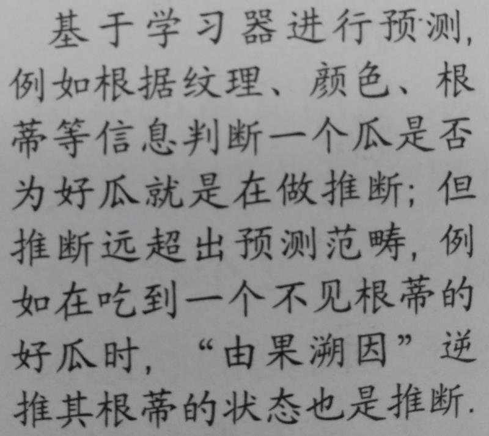

# 通用文字识别（RecognizeText）

本项目主要介绍以下内容：

* 如何调用faceplusplus（旷视科技）的人工智能开放平台API接口进行通用文字识别

关于旷视科技的通用文字识别技术的介绍，可参考网站：https://www.faceplusplus.com.cn/general-text-recognition/

* 如何利用"汉王OCR"软件进行通用文字识别

关于"汉王OCR"技术的介绍，可参考网址：http://ka.hanwang.com.cn/sbjs/ocrjs/

另外，谷歌开源了一个OCR技术代码，主要用于英文字体的识别，代码地址为：https://github.com/tesseract-ocr/tesseract

下面网站可用于多国字体的识别：http://www.to-text.net/

----

## 旷视科技Recognize Text API

旷视科技为人工智能领域的优秀企业，支付宝的人脸识别技术由其提供。

Recognize Text API为旷世科技提供的通用文字识别API，更多的应用可参考网址：https://console.faceplusplus.com.cn/dashboard

关于Recognize Text API的使用，具体可参考网址：https://console.faceplusplus.com.cn/documents/7776484

Recognize Text API可以通过POST调用，其具体实现方法有：

* 在Shell中使用curl

* 在Chrome中可以使用Postman插件

* 在python中我们可以使用requests库中的post方法

接下来，我们主要介绍如何利用Python调用Recognize Text API。

### Python调用Recognize Text API的步骤

* **Step1:阅读Recognize Text API的文档，明确API的调用方法、调用URL、输入参数、返回参数等内容**

具体可参考网址：https://console.faceplusplus.com.cn/documents/7776484

* **Step2:创建API Key**

登录旷视科技网站，注册账号，并创建API Key。具体过程可参考网页：https://console.faceplusplus.com.cn/documents/5671787

* **Step3:利用Python中request库中的post方法，向API发送请求**

通过Python中requests库的post方法向Recognize Text API的URL传递三个参数：api_key、api_secret、image_file，并获取返回结果

* **Step4:将返回结果解析问成段的文字**

Recognize Text API返回的结果主要是：文字的坐标、文字的内容，因此需要自己排版。

ps:Step3-Step4可参考代码：调用API进行文字识别.py

## 汉王OCR的使用

参考Word文档：汉王OCR的使用

## 关于文字识别的说明

在有些例子中，识别效果并不好，主要原因由一下几点：

* 经过微信传输的图片被严重压缩，文字会变模糊，尤其是文字的边缘；

* 书没有放平整，拍摄照片发生卷曲；

* 光照不能太昏暗，也不能反光，否则不易识别。

总之，如果人能够看得很清楚，那么机器也能很好的识别。很多时候，虽然我们感觉排出的照片很清晰，但将照片放大后就会发现其实很模糊。

## 例子

对上面图片进行识别，识别结果为：

翻译结果为:基于学习器进行预测1例如根据纹理颜色根蒂等信息判断个瓜是否为好瓜就是在做推断但推断远超出预测范畴例如在吃到个不见根蒂的口-2由果溯因逆瓜时女推其根蒂的状态也是推断

